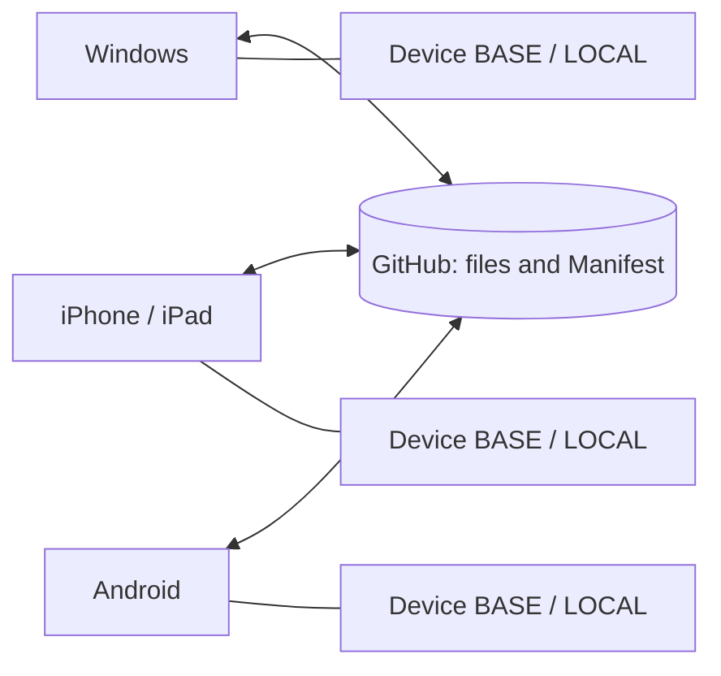

# Stateful Git Sync

English · [简体中文](README.zh-CN.md)

**Stateful synchronization across devices, with GitHub as the shared transport.**

Stateful Git Sync synchronizes Obsidian notes and attachments by tracking what each device last verified, what changed locally, and what changed remotely. Its goal is to bring the files in the shared sync scope to the same reviewed state across devices, including edits, renames and deletions.

## What makes it different

A workflow built around `git pull`, `git push` and text merge handles repository history. Multi-device vault synchronization also needs to know whether a missing file is an intentional deletion, whether a renamed file is still the same file, and whether an interrupted operation actually finished.

Stateful Git Sync makes these questions part of the synchronization protocol:

| Concern | How Stateful Git Sync handles it |
| --- | --- |
| What changed on each device? | Compare a device's last verified **BASE** with current **LOCAL** and **REMOTE**, rather than compare only the two current copies. |
| Deletions from an offline device | Retain deletion records (**tombstones**) and stable file identities so an unchanged old copy can receive the deletion instead of re-uploading the note. A deletion concurrent with an edit requires review. |
| Renames and attachments | Track logical file identity separately from its path. Propagate renames when identity is established; uncertain identity or path collisions stop the plan. The same review model applies to text and binary files. |
| Conflicting edits | Require an explicit **Use LOCAL / Use REMOTE** choice for supported conflicts. No automatic text merge or last-writer-wins rule. Keep both edits in separate copies if you need to merge them manually. |
| A new, empty device | Initialize from the remote Manifest and establish its own BASE. An empty device without sync history is not evidence that the remote files should be deleted. |
| Interrupted synchronization | Keep transaction journals and recovery copies, then resume and verify the transaction. A successful upload alone is not a completed sync. |
| Completion | Publish files and their Manifest together, verify the remote snapshot and relevant local bytes, then save and read back the verified BASE before recording success. |

For example, if a laptop deletes an unchanged note while a phone is offline, the phone can later apply the recorded deletion. If the phone edited that note while offline, the deletion and edit become a conflict to review. A text merge alone does not express that decision.

**Multi-device consistency is reached through successful syncs against the same repository and scope.** Devices keep independent verified baselines; they are not all updated at once. Auto Sync is off by default and does not poll GitHub, so run a manual Preview when switching devices to fetch remote changes. This is file synchronization, not real-time collaborative editing.

[Install](#installation) · [Latest release](https://github.com/ZainHuang/stateful-git-sync/releases/latest) · [Report an issue](https://github.com/ZainHuang/stateful-git-sync/issues) · [Compatibility](docs/compatibility.md) · [Security](SECURITY.md)

## V1.2: incremental sync and smart verification

Normal sync reads dirty files and reuses previously verified hashes. It still reconciles the complete eligible file inventory and required metadata, and rotates through up to eight unchanged files for content audits. Mutable remote HEAD is always fetched; validated immutable Commit/Tree/Manifest metadata can be reused.

**Incremental Verified** proves the changed files, deletion/rename results, remote snapshot and BASE while using trusted hashes for unchanged files. **Full Integrity Verified** additionally hashes every eligible local file. Restart, mobile foreground/resume, damaged caches, unobserved inventory/metadata changes, changed ignore scope, a 24-hour deadline or the twentieth sync trigger full reconciliation. Initialization and Recovery with local writes also use full verification. Standalone **Verify Sync (read-only)** always audits all local content. The existing published Recovery path that preserves subsequent local edits is labeled **Published Snapshot Verified**.

The shared activity view shows **检查差异 → 同步文件 → 安全校验**, actual counts and elapsed time. Expand **技术详情** for technical stages and read/hash/API measurements. Completion leaves a static **Verified** status; conflicts and Recovery expose the required actions.

The derived `local-change-index.json` cache is stored inside the existing plugin directory and can be rebuilt without changing device identity or BASE. Keep the normal upgrade procedure and retained Recovery records. See the [validation record](docs/validation.md) for measured results and the physical-device validation boundary.

## How synchronization works

The plugin runs on desktop and mobile without installing Git, Node.js or a server on your phone. Each device exchanges notes, attachments and file identity information through the same GitHub repository.



| State | Meaning |
| --- | --- |
| **BASE** | This device's last verified common snapshot, stored independently on each device. |
| **LOCAL** | The files currently present on this device. |
| **REMOTE** | The files and verified Manifest on the target GitHub branch. |

When only LOCAL changed relative to BASE, the plan proposes a push. When only REMOTE changed, it proposes a pull. Different changes to the same file require conflict review. Deletions use BASE, file identity and tombstone evidence; a file missing from one side is not automatically a deletion.

The normal workflow is **Preview → review operations and conflicts → Sync & Verify → save and read back BASE**. When publication is needed, files and Manifest are written in one commit; branch updates use `force:false`. Stale previews must be regenerated.

GitHub is the shared synchronization medium, not just a one-way backup. Create a separate **private repository for your notes**; this public repository contains the plugin source code.

## Installation

Requires **Obsidian 1.6.0 or newer**. Search for **Stateful Git Sync** in **Settings → Community plugins**, then install and enable it. You can also open the [community listing](https://community.obsidian.md/plugins/local-mirror-sync).

The display name is Stateful Git Sync; the installation ID remains `local-mirror-sync` for upgrade compatibility.

### Manual installation

1. Download `main.js`, `manifest.json` and `styles.css` from the [latest release](https://github.com/ZainHuang/stateful-git-sync/releases/latest). The automatically generated Source code archives are not plugin installation bundles.
2. Create `.obsidian/plugins/local-mirror-sync/` inside your vault and put the three files there. If you use a custom configuration directory, use it instead of `.obsidian`. Android file managers may need hidden files enabled.
3. Restart Obsidian and enable **Stateful Git Sync** in **Settings → Community plugins**.

```text
YourVault/
  .obsidian/plugins/local-mirror-sync/
    main.js
    manifest.json
    styles.css
```

To upgrade manually, disable the plugin, replace only those three files, then enable it again. **Preserve `data.json`, `sync-state.json`, `device-state.json`, `product-state.json`, `.sync-history/` and `.local-mirror-sync/`.** If Recovery is pending, continue with Review Recovery after upgrading.

### Installation with BRAT

On iOS/iPadOS, where hidden plugin directories are harder to manage, you can install **BRAT** from Community plugins and add `https://github.com/ZainHuang/stateful-git-sync` as a beta plugin. Choose the latest release and enable Stateful Git Sync. BRAT also works on Windows and Android; see the [official BRAT guide](https://github.com/TfTHacker/obsidian42-brat).

BRAT handles installation and updates. Configure your notes repository token in **Stateful Git Sync settings**. Installing this public plugin does not require that token. Keep the existing installation ID when upgrading.

## GitHub setup

### Create a notes repository

Create a separate **private** repository, for example `my-vault`, with an existing branch such as `main`. Include a README when creating it to ensure that the branch has a commit. The plugin does not create repositories or interpret missing branches and access errors as empty repositories.

That initial README puts the repository into **Legacy Adoption**, described below. You will explicitly choose whether your existing local notes or the GitHub contents are authoritative for this one-time setup.

### Create a fine-grained personal access token

1. In GitHub, open **Settings → Developer settings → Personal access tokens → Fine-grained tokens → Generate new token**.
2. Choose a name, expiration and resource owner.
3. Under Repository access, choose **Only select repositories** and select your notes repository.
4. Grant **Contents: Read and write** and the required Metadata read access.
5. Enter the token in the plugin's **GitHub Token** field and select **Save settings**. Separate tokens per device make revocation easier.

Organization repositories may require approval. Synchronizing `.github/workflows/` also requires the corresponding Workflows permission; ordinary note vaults can ignore that directory. See GitHub's [token guide](https://docs.github.com/en/authentication/keeping-your-account-and-data-secure/managing-your-personal-access-tokens) and [permissions reference](https://docs.github.com/en/rest/authentication/permissions-required-for-fine-grained-personal-access-tokens).

| Setting | Example / recommendation |
| --- | --- |
| GitHub Owner | Your GitHub username or organization. |
| Repository | `my-vault`; enter only the repository name. |
| Branch | `main`; it must already exist. |
| GitHub Token | The token created above. |
| Device name / type | For example `Home-PC` / Desktop or `Phone` / Mobile; avoid sensitive information. |
| Include .obsidian | Off by default; keep it off for initial setup. |
| Ignore Patterns | One pattern per line; keep the scope consistent across devices. |
| Auto Sync | Keep off during initialization. |

Credentials use Obsidian SecretStorage when available. Otherwise, settings warn that the token is stored in the local plugin's `data.json`; do not copy it to another device. Leaving the token field untouched preserves the credential; explicitly clearing it and saving removes it.

## First device setup

1. Back up your vault, install the plugin, and save the GitHub settings.
2. Run **Stateful Git Sync: Initialize / Adopt Vault** or **Preview Sync**.
3. Follow the mode shown in the preview:

| Mode | When it appears | Action |
| --- | --- | --- |
| INITIALIZE | No BASE and no user files in the branch's sync scope. | Review the upload list and run **Sync & Verify** to create the Manifest. |
| ADOPT / Legacy repository | No BASE; GitHub contains files but no Manifest. | Explicitly select **Use Local** or **Use Remote** before adoption. |
| BOOTSTRAP / ATTACH | GitHub already has a valid Manifest. | Follow the new-device steps below. |

**Use Local** makes the remote sync scope match local files, including overwriting remote content and deleting remote-only files. **Use Remote** makes the local scope match remote files, including overwriting local content and removing local-only files. Review all effects, type exactly `USE LOCAL` or `USE REMOTE`, and select **Adopt & Verify**. Legacy Adoption creates and verifies a GitHub backup branch before mutation.

If the first computer contains all your notes and GitHub contains only its initial README, review **Use Local**; the plan also lists removal of that README. This global authority choice is only for adopting a repository without BASE or Manifest, not a permanent policy for future syncs.

Confirm successful verification, BASE generation and Dashboard status before adding the next device.

## Add a new device

1. Create an independent vault on Windows, iPhone or Android and install the plugin.
2. Install only the plugin code files. **Do not copy another device's token, BASE, deviceId, history or Recovery state.**
3. Set the same Owner / Repository / Branch, use this device's token, and match the sync scope.
4. Run **Initialize / Adopt Vault** or **Initialize from GitHub** in settings.
5. An empty vault with a valid remote Manifest enters **BOOTSTRAP**: review the download list, then select **Sync & Verify**. A vault with existing files enters **ATTACH**: keep files from both sides and review same-path content conflicts.
6. Wait for verification to succeed. The device now has its own deviceId and BASE.

Do not delete `sync-state.json` to reset an old device: it contains the history needed to recognize deletions and conflicts. If BASE exists but the remote Manifest is missing or invalid, synchronization stays blocked instead of automatically adopting the repository.

## Daily synchronization

Run **Stateful Git Sync: Sync (review first)**. Review pushes, pulls, deletions, renames and conflicts, then select **Sync & Verify**. The list shows changed documents, 10 per page. Removing more paths than the Delete Safety Threshold requires the exact confirmation `DELETE N`; the default threshold is 20 and rename source paths count toward it.

Check remote changes before editing and synchronize when finished. Wait for completion before closing the app. If files change after Preview, regenerate the plan.

On mobile, tap a file to open a separate details dialog and choose **Use LOCAL / Use REMOTE**. You can also apply **Use LOCAL / REMOTE for all conflicts** to the conflicts in the captured preview, including filtered-out conflicts. Other operations retain their planned behavior. These choices update the preview; **Sync & Verify** executes it.

**LOCAL** means this device; **REMOTE** means GitHub. An explicit choice includes that side's absence of a file and can therefore cause deletion. Keeping an untracked local file assigns a new identity instead of inferring a rename. Unresolved duplicate paths, invalid destinations and repository-level diagnostics still block execution.

**Open Dashboard** shows cached repository, device, file-count, health and Recovery information. **Sync History** shows this device's latest 100 verified transactions; older JSON records remain on disk. These views do not request GitHub and are not live online status. Run Preview to check the remote state.

## Auto Sync

Auto Sync defaults to **OFF**. After initialization and a successful manual sync, you can enable it in settings. Local vault create, modify, delete and rename events trigger a debounced check after **30 seconds** by default. It executes only small, conflict-free plans that pass safety checks; defaults allow at most **5 removed paths and 20 changed files**.

It does not periodically poll GitHub. Merely opening Obsidian does not trigger a remote scan or pull. Conflicts, a remote Manifest changed relative to BASE, initialization, Adoption, scope changes, Recovery and threshold violations pause automatic execution for manual review. Check the Dashboard reason and run Preview; a paused sync is not a completed sync.

## Verification and conflict review

Executing synchronization verifies the remote commit, Tree and Manifest, relevant local bytes, and saved sync state. **BASE advances and success history is recorded only after successful verification.**

**Verify Sync (read-only)** is a status check: it does not upload, download, resolve conflicts or advance BASE. If it finds differences, return to a normal Preview.

For conflicts, inspect both versions and preserve independent copies of important content before choosing a side. If you need both edits, merge them manually in a separate copy, then review the final result. The plugin does not merge text automatically. Case/Unicode collisions, uncertain identity and invalid path combinations remain blocked when a safe result cannot be established; do not delete BASE or Manifest to hide them.

## Recover an interrupted sync

Network interruption, app exit or failed verification can leave **Pending Recovery**. This means a transaction needs review; it does not by itself mean files are damaged.

1. Stop new syncs and preserve `.local-mirror-sync/transactions/`.
2. Open **Review Recovery** from the Dashboard or **Recover interrupted sync**, and check the repository, transaction ID, phase and error.
3. Use **Resume Transaction** when appropriate. It rechecks the target, commits, backups and local state before continuing or finishing verification. If object creation failed before a candidate commit existed, Resume can safely clear the pending pointer so you can generate a new Preview.
4. **Abort Transaction** is available only for an unpublished prepared transaction with unchanged remote HEAD. It removes the active pointer while retaining backups; it does not roll back notes, BASE or GitHub, and cannot undo a published commit.

For `RECOVERY_ENV_CHANGED`, follow the specific target, device identity, branch history or backup error, correct the condition, then retry **Resume Transaction**. Normal Preview stays blocked until Recovery completes or a safe Abort succeeds. Preserve independent copies. For an older transaction reporting `LEGACY_CURRENT_STATE_DIFFERS`, use **Start fresh Preview from current HEAD** only when the UI offers it. This preserves the original BASE and transaction audit; it does not declare the old transaction verified.

For `RECOVERY_LOCAL_CHANGED` or `LOCAL_VERIFY_FAILED`, inspect the listed paths. A published transaction with local writes can offer **Start fresh Preview from current HEAD**. This explicit action revalidates the published transaction and current remote state, verifies retained recovery copies, backs up current Local bytes, and keeps files and BASE unchanged. It retains the old transaction and a review audit, then opens the normal Preview for explicit conflict choices. It does not replay old writes or record the interrupted transaction as successful. Scope changes such as `RECOVERY_SCOPE_CHANGED` must be corrected before proceeding.

For confirmed published transactions without local writes, including **Use Local** adoption, Recovery can verify the published snapshot and establish its BASE even if another device advances the branch to a descendant. Later edits remain for the next Preview, where both-device changes can require an explicit conflict choice. The retained backup must still verify. Unconfirmed adoption and adoption with local writes continue to require the exact candidate HEAD.

Recovery objects may contain note contents and are not automatically garbage-collected. Do not publish them or remove objects referenced by journals. Report redacted error codes and reproduction steps, not a vault, token or complete Recovery directory.

## Sync scope and limits

Rules from the vault's root `.gitignore` are followed by **Ignore Patterns** in settings, one Git-style pattern per line:

```gitignore
*.mp3
*.m4a
*.wav
private/**
.github/workflows/**
```

Audio is excluded only when a rule matches. The per-file limit is **20 MiB** and the Manifest limit is **2 MiB**. Ignore or separately manage larger attachments. Symlinks, submodules and non-portable paths are unsupported.

`.git/`, `.trash/`, this plugin's directory, tokens/state, Recovery, local history and Obsidian workspace/cache files stay protected, even with `!**`. `.obsidian` is excluded by default; enabling it retains the protected exclusions.

Scope changes can trigger **SCOPE_REVIEW** rather than inferred deletions. Keep rules consistent across devices. Newly included remote files not tracked by Manifest block the plan rather than being silently adopted.

## Mobile and security boundaries

Windows, iOS and Android use the same mobile-compatible bundle and Obsidian Vault APIs. Keep Obsidian in the foreground with a working connection during synchronization: mobile operating systems may suspend background apps, and Auto Sync is not a system background service.

Validation covers real Windows Obsidian, HTTP fixture integration and narrow/mobile emulation. **Physical iPhone and Android acceptance is still pending**; emulation does not establish a guarantee for those devices. Validate your environment with a test vault first.

The plugin accesses `api.github.com` directly over HTTPS without a relay server. Notes are **not end-to-end encrypted by this plugin**; accounts with repository access can read them. Use a private notes repository. Device names, IDs and reports can be published to that repository with related pushes. See [SECURITY.md](SECURITY.md).

Keep independent backups. Avoid concurrent writers such as another bidirectional sync engine, Git auto-commit tool or cloud drive against the same vault. The plugin does not promise that data loss is impossible.

## Troubleshooting

| Symptom | What to check |
| --- | --- |
| 401 / 403 | Token expiration, repository access, Contents permission, organization approval or rate limits. |
| 404 / 409 or missing branch | Owner, repository, branch, access and the initial commit. |
| Auto Sync did not fetch another device's changes | Run manual Preview; Auto Sync does not poll. |
| Stale Preview | Close it and generate a fresh plan. |
| Pending Recovery | Review Recovery, then Resume or Abort when available; retain recovery data. |
| Manifest / Tree mismatch | Stop external repository writers and preserve the state for investigation. |
| LOCAL_STATE_INVALID | Preserve state and Recovery; do not delete state to impersonate a new device. |
| Same-name files differ on a new phone | Review ATTACH conflicts or preserve independent copies first. |
| Oversized files or invalid paths | Ignore/split large files and fix case, Unicode or Windows-invalid names. |
| Dashboard looks stale | It is local cache; run Preview. |

When reporting an issue, include plugin/Obsidian versions, platform, error codes and synthetic reproduction notes. Do not include tokens or private notes.

## Development

Requires Node.js **24+** and npm. Dependencies are locked:

```sh
npm ci
npm run typecheck
npm run lint
npm test
npm run test:property
npm run build
npm run audit:public
```

`npm test` generates synthetic fixtures. Generated fixtures, profiles, logs, screenshots, Recovery and build output are not committed. The bundle is in `dist/stateful-git-sync/`; `obsidian` is its only external runtime dependency.

Real-application integration tests run on Windows with an isolated generated vault/profile and a local HTTP GitHub fixture:

```powershell
$env:OBSIDIAN_EXE = 'C:\Path\To\Obsidian.exe'
$env:LMS_SKIP_LIVE_GITHUB = '1'
npm run fixtures
npm run test:obsidian
npm run test:obsidian:v1
npm run test:obsidian:v11
npm run test:obsidian:v111
npm run test:obsidian:v112
npm run test:obsidian:v113
npm run test:obsidian:v114
npm run test:obsidian:activity
npm run test:obsidian:lifecycle
npm run test:obsidian:dashboard
npm run test:obsidian:publish
npm run test:obsidian:manifest
npm run test:obsidian:brand
```

These suites share fixed test ports and must run sequentially, without connecting to personal Obsidian sessions. Public CI runs typecheck, lint, unit/property tests, build and the public-file audit.

After building, `powershell -NoProfile -File scripts/package-release.ps1` produces an installation ZIP and `SHA256SUMS.txt`. The ZIP retains the compatible `local-mirror-sync` directory. `npm run audit:public` checks tracked files and bundles, reporting paths/rules without printing suspected secrets; human review is still required.

Preserve sync protocol and state compatibility. New behavior needs regression tests. See [compatibility](docs/compatibility.md) and [validation scope](docs/validation.md).

## License

[MIT](LICENSE). The bundle includes the third-party license notices for `@noble/hashes` and `ignore`.
